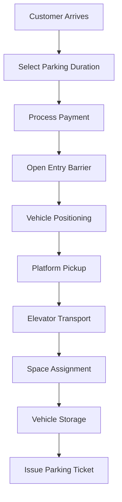

# Automated Car Parking Vending System

## 🚗 Project Overview

An advanced industrial automation system that operates like a vending machine for cars - customers insert payment, the system automatically parks their vehicle in an optimal location, and retrieves it when requested. This comprehensive PLC-based solution includes elevator mechanisms, robotic platforms, payment processing, and real-time monitoring.

## 🏗️ System Architecture

### Core Components
- **PLC Control System**: Siemens S7-1200 with distributed I/O modules
- **Elevator Mechanisms**: 3 high-speed vertical transport systems
- **Robotic Platforms**: Automated guided vehicles (AGVs) for car positioning
- **Payment Kiosks**: Multi-modal payment acceptance with RFID/NFC support
- **HMI Interface**: Touch-screen operator panels and web-based monitoring
- **Safety Systems**: Emergency stops, fire detection, collision avoidance

### System Specifications
```
Total Capacity: 300 vehicles
Tower Configuration: 15 levels × 20 spaces per level
Elevator Speed: 2.5 m/s vertical, 1.5 m/s horizontal
Processing Time: 90 seconds average (park/retrieve)
Payment Methods: Cash, Credit/Debit, RFID, Mobile App
Operating Hours: 24/7 automated operation
```

## 🔧 Hardware Configuration

### PLC I/O Mapping

#### Digital Inputs (24V DC)
| Address | Description | Type |
|---------|-------------|------|
| I0.0 | Emergency Stop - Main | NO |
| I0.1 | Emergency Stop - Level 1 | NO |
| I0.2 | Emergency Stop - Level 2 | NO |
| I0.3 | Fire Detection - Zone 1 | NO |
| I0.4 | Fire Detection - Zone 2 | NO |
| I0.5 | Fire Detection - Zone 3 | NO |
| I0.6 | Entry Barrier - Open Limit | NO |
| I0.7 | Entry Barrier - Close Limit | NO |
| I1.0 | Exit Barrier - Open Limit | NO |
| I1.1 | Exit Barrier - Close Limit | NO |
| I1.2 | Vehicle Present - Entry | NO |
| I1.3 | Vehicle Present - Exit | NO |
| I1.4 | Elevator 1 - Home Position | NO |
| I1.5 | Elevator 2 - Home Position | NO |
| I1.6 | Elevator 3 - Home Position | NO |
| I1.7 | Platform - Home Position | NO |
| I2.0 | Door Interlocks - All Closed | NO |
| I2.1 | Hydraulic System - Pressure OK | NO |
| I2.2 | UPS System - Battery OK | NO |
| I2.3 | Ventilation - Status OK | NO |

#### Analog Inputs (4-20mA / 0-10V)
| Address | Description | Range | Unit |
|---------|-------------|-------|------|
| AI0 | Elevator 1 - Position | 0-45000 | mm |
| AI1 | Elevator 2 - Position | 0-45000 | mm |
| AI2 | Elevator 3 - Position | 0-45000 | mm |
| AI3 | Platform - X Position | 0-6000 | mm |
| AI4 | Platform - Y Position | 0-15000 | mm |
| AI5 | Hydraulic Pressure | 0-250 | bar |
| AI6 | Temperature - Control Room | -10 to 60 | °C |
| AI7 | Humidity - Control Room | 0-100 | % |
| AI8 | Load Cell - Platform Weight | 0-5000 | kg |
| AI9 | Power Consumption | 0-500 | kW |

#### Digital Outputs (24V DC)
| Address | Description | Type |
|---------|-------------|------|
| Q0.0 | Entry Barrier - Open | Relay |
| Q0.1 | Entry Barrier - Close | Relay |
| Q0.2 | Exit Barrier - Open | Relay |
| Q0.3 | Exit Barrier - Close | Relay |
| Q0.4 | Elevator 1 - Motor Enable | Relay |
| Q0.5 | Elevator 2 - Motor Enable | Relay |
| Q0.6 | Elevator 3 - Motor Enable | Relay |
| Q0.7 | Platform - X Axis Enable | Relay |
| Q1.0 | Platform - Y Axis Enable | Relay |
| Q1.1 | Hydraulic Pump - Start | Relay |
| Q1.2 | Ventilation Fan - Start | Relay |
| Q1.3 | Emergency Lighting - On | Relay |
| Q1.4 | Status Light - Green | LED |
| Q1.5 | Status Light - Yellow | LED |
| Q1.6 | Status Light - Red | LED |
| Q1.7 | Alarm Horn | Relay |
| Q2.0 | Door Lock - Entry | Solenoid |
| Q2.1 | Door Lock - Exit | Solenoid |

#### Analog Outputs (4-20mA / 0-10V)
| Address | Description | Range | Unit |
|---------|-------------|-------|------|
| AQ0 | Elevator 1 - Speed Reference | 0-2500 | mm/s |
| AQ1 | Elevator 2 - Speed Reference | 0-2500 | mm/s |
| AQ2 | Elevator 3 - Speed Reference | 0-2500 | mm/s |
| AQ3 | Platform - X Speed Reference | 0-1500 | mm/s |
| AQ4 | Platform - Y Speed Reference | 0-1500 | mm/s |
| AQ5 | Hydraulic Pressure Reference | 0-250 | bar |

## 🏢 System States

### Main Operation States
1. **INIT** - System initialization and self-diagnostics
2. **IDLE** - Waiting for customer input
3. **PAYMENT** - Processing payment transaction
4. **ENTRY** - Vehicle entry and positioning
5. **PARKING** - Automated parking sequence
6. **PARKED** - Vehicle stored, system ready
7. **RETRIEVAL** - Automated retrieval sequence
8. **EXIT** - Vehicle delivery to customer
9. **MAINTENANCE** - Service and diagnostic mode
10. **EMERGENCY** - Emergency stop and safety procedures

### Parking Sequence


## 💻 Software Components

### PLC Programs (Structured Text - IEC 61131-3)
- **main.st** - Main control logic and state machine
- **global_vars.st** - Global variable declarations and I/O mapping
- **parking_controller.st** - Automated parking sequence control
- **elevator_controller.st** - Elevator motion and positioning
- **safety_controller.st** - Safety interlocks and emergency procedures
- **payment_controller.st** - Payment processing and validation
- **diagnostics.st** - System diagnostics and maintenance

### HMI Applications
- **Desktop GUI** (Python/Tkinter) - Operator interface with real-time monitoring
- **Web Interface** (HTML5/JavaScript/WebSocket) - Remote monitoring and control
- **Touch Panel** (WinCC/FactoryTalk) - Local operator stations

### Simulation & Testing
- **Parking Simulator** (Python) - Virtual parking system for testing
- **Load Testing** - Performance and stress testing utilities
- **Unit Tests** - Individual component testing framework

## 🚀 Getting Started

### Prerequisites
```bash
# Install Python dependencies
pip install -r requirements.txt

# Install Node.js dependencies for web HMI
cd hmi/web
npm install
```

### Running the System

1. **Start PLC Simulation**
```bash
python src/simulation/plc_simulator.py
```

2. **Launch Desktop HMI**
```bash
python src/gui/main_hmi.py
```

3. **Start Web Interface**
```bash
cd hmi/web
npm start
```

4. **Run Parking Simulator**
```bash
python src/simulation/parking_simulator.py
```

## 📊 Performance Metrics

### Key Performance Indicators
- **Throughput**: 40 vehicles/hour (peak capacity)
- **Average Parking Time**: 90 seconds
- **Average Retrieval Time**: 75 seconds
- **System Availability**: >99.5%
- **Energy Efficiency**: 15 kWh per vehicle operation

### Monitoring Dashboard
- Real-time space occupancy
- Queue length and wait times
- System performance metrics
- Revenue and transaction analytics
- Maintenance scheduling and alerts

## 🔒 Safety Features

### Emergency Systems
- Multiple emergency stop circuits
- Fire detection and suppression
- Smoke evacuation systems
- Emergency vehicle evacuation procedures
- Backup power systems (UPS)

### Security Features
- 24/7 CCTV monitoring
- Access control and authentication
- Vehicle identification and tracking
- Anti-theft protection systems
- Cyber security protocols

## 🛠️ Maintenance

### Preventive Maintenance
- Daily: Visual inspections, system status checks
- Weekly: Mechanical component lubrication
- Monthly: Elevator and platform calibration
- Quarterly: Full system diagnostics and testing
- Annually: Complete overhaul and recertification

### Diagnostic Tools
- Real-time system monitoring
- Predictive maintenance analytics
- Component lifecycle tracking
- Performance trend analysis
- Remote diagnostic capabilities

## 📁 Project Structure
```
Car_Parking_Vending_System/
├── plc/                     # PLC programs and configuration
├── hmi/                     # Human Machine Interface
│   ├── desktop/            # Desktop applications
│   └── web/                # Web-based interfaces
├── src/                     # Source code
│   ├── gui/                # GUI applications
│   ├── simulation/         # System simulators
│   ├── database/           # Database management
│   ├── communication/      # Network protocols
│   └── utilities/          # Helper functions
├── docs/                    # Documentation
│   ├── technical/          # Technical specifications
│   └── user/               # User manuals
├── config/                  # Configuration files
├── tests/                   # Test suites
├── scripts/                 # Automation scripts
└── diagrams/               # System diagrams
```

## 🔧 Configuration

### System Parameters
- Maximum vehicle dimensions: 5.2m × 2.1m × 1.8m (L×W×H)
- Maximum vehicle weight: 3500 kg
- Operating temperature: -10°C to +50°C
- Parking fee structure: Configurable hourly/daily rates
- Payment timeout: 120 seconds
- Retrieval timeout: 300 seconds

## 📞 Support

For technical support, maintenance requests, or system integration:
- **Emergency**: 24/7 hotline available
- **Technical Support**: Online ticket system
- **Documentation**: Comprehensive user and technical manuals
- **Training**: Operator certification programs available

---

**Version**: 2.1.0  
**Last Updated**: January 2025  
**Compatibility**: Siemens S7-1200/1500, TIA Portal V17+
